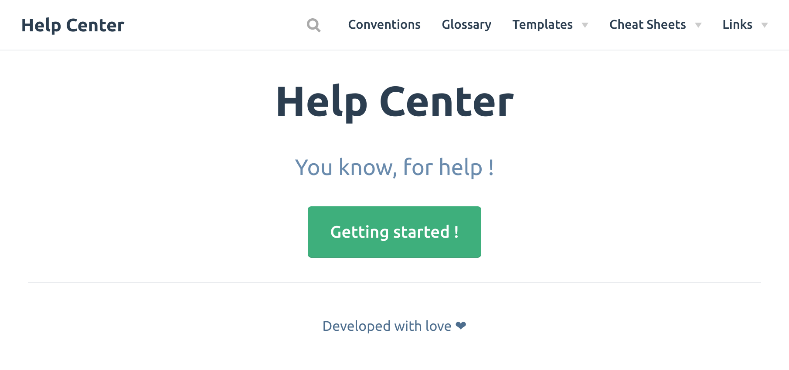

# Vuepress help-center template

> A template for creating a help-center with [vuepress](https://vuepress.vuejs.org/).




## Development setup

With [devcontainer](https://code.visualstudio.com/docs/remote/containers):

```sh
yarn docs:dev
```

With `make`:

```sh
make dev
```

With `docker-compose`:
```sh
docker-compose up -d --build
```

## Build

With [devcontainer](https://code.visualstudio.com/docs/remote/containers):

```sh
yarn docs:build
```

With `make`:

```sh
make build
```

With `docker-compose`:
```sh
docker-compose build
docker-compose run app yarn docs:build
```

## License

Licensed under the MIT License. See [LICENSE](LICENCE).