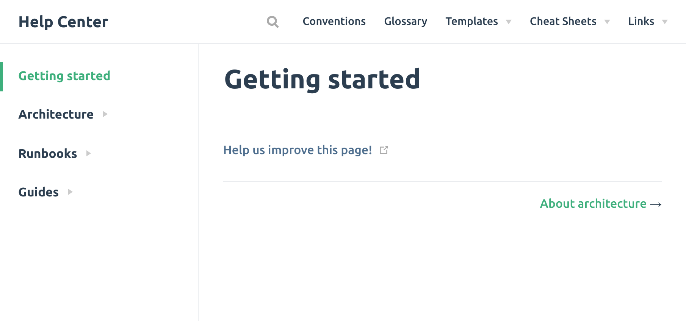

# Vuepress help-center template

> A template for creating a help-center with [vuepress](https://vuepress.vuejs.org/).

See on [github pages](https://jvautier.github.io/vuepress-helpcenter-template/)




## Requirements

- [yarn](https://yarnpkg.com/)

or
- [docker-compose](https://docs.docker.com/compose/)

or
- [devcontainer](https://code.visualstudio.com/docs/remote/containers)

## Setup

With `make`:

```sh
make dev
```

_With `docker-compose` there is no setup phase_

## Development setup

With `make`:

```sh
make dev
```

or With `docker-compose`:
```sh
docker-compose up -d --build
```

## Build

With `make`:

```sh
make build
```

or With `docker-compose`:
```sh
docker-compose build
docker-compose run app yarn docs:build
```

## Deploy

With `make`:

```sh
make deploy
```

or
```sh
./scripts/deploy.sh
```

## License

Licensed under the MIT License. See [LICENSE](LICENCE).